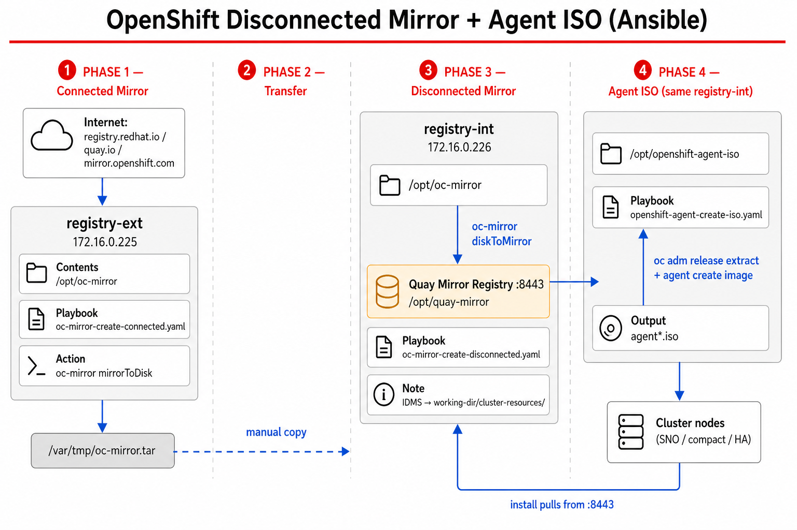

# ansible_oc-mirror

Ansible roles and playbooks for a **disconnected OpenShift** workflow: mirror release and operator content with **oc-mirror v2**, populate an internal Quay registry, then build an **Agent-based Installer** ISO from that mirror.

## Architecture



| Phase | Playbook | Host | What it does |
|-------|----------|------|--------------|
| 1 — Connected | `playbooks/oc-mirror-create-connected.yaml` | `registry-ext` | `oc-mirror` mirrorToDisk into `/opt/oc-mirror`, archive to `/var/tmp/oc-mirror.tar` |
| 2 — Transfer | (manual) | ext → int | Copy the archive to the disconnected host |
| 3 — Disconnected | `playbooks/oc-mirror-create-disconnected.yaml` | `registry-int` | Install Quay on `:8443` if needed, then diskToMirror into the registry |
| 4 — Agent ISO | `playbooks/openshift-agent-create-iso.yaml` | `registry-int` | Extract installer from the mirrored release, render configs, produce `agent*.iso` |

Cluster nodes boot the ISO and pull install images from the internal registry.

## Roles

### [`oc-mirror`](roles/oc-mirror/README.md)

Two-phase **oc-mirror v2** mirroring for connected and disconnected environments.

- **Connected** — Download OpenShift release content (and operators / additional images from the ImageSet) to disk and pack a transfer archive.
- **Disconnected** — Install the Quay mirror registry when it is not already healthy, restore the workspace from the archive if needed, and push content with diskToMirror.

Inventory groups `connected_mirror` and `disconnected_mirror` are children of `oc_mirror` and share `group_vars/oc_mirror.yml`.

### [`openshift-agent-iso`](roles/openshift-agent-iso/README.md)

Build an OpenShift **Agent-based Installer** ISO from the populated disconnected mirror.

- Log in to the mirror and build a mirror-only pull secret.
- Load ImageDigestMirrorSet (IDMS) and the mirror TLS trust bundle for `install-config.yaml`.
- Extract `openshift-install` with `oc adm release extract --idms-file=...`.
- Render `install-config.yaml` and `agent-config.yaml` (NMState networking, bonds/VLANs, machineNetwork from host `role: node`).
- Run `openshift-install agent create image`.

Requires a completed disconnected mirror (Quay content + oc-mirror IDMS under `/opt/oc-mirror/working-dir/cluster-resources/`). Cluster inputs live in `group_vars/openshift_agent_iso.yml`.

## Quick start

Secrets are expected from vault (for example `-e @vault/quay_secrets.yaml`). See each role README for required variables.

```bash
# 1. Connected mirror (internet-facing host)
ansible-playbook playbooks/oc-mirror-create-connected.yaml \
  -i inventory.yaml \
  -e @vault/quay_secrets.yaml \
  --vault-password-file /path/to/.vault_password

# 2. Copy /var/tmp/oc-mirror.tar from registry-ext to registry-int

# 3. Disconnected mirror (internal Quay host)
ansible-playbook playbooks/oc-mirror-create-disconnected.yaml \
  -i inventory.yaml \
  -e @vault/quay_secrets.yaml \
  --vault-password-file /path/to/.vault_password

# 4. Agent ISO
ansible-playbook playbooks/openshift-agent-create-iso.yaml \
  -i inventory.yaml \
  -e @vault/quay_secrets.yaml \
  -e openshift_ssh_key="$(cat ~/.ssh/id_ed25519.pub)" \
  --vault-password-file /path/to/.vault_password
```

Install collections from `requirements.yaml` before first use (`ansible-galaxy collection install -r requirements.yaml`).

## Further reading

- [oc-mirror role](roles/oc-mirror/README.md) — paths, ImageSet variables, Quay install, archive transfer
- [openshift-agent-iso role](roles/openshift-agent-iso/README.md) — topology rules, networking, IDMS extract, ISO outputs
